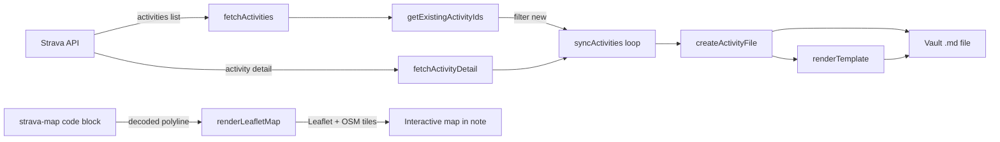
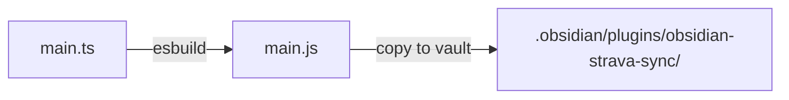

# Architecture

---

## Overview

Obsidian Strava Sync is a single-file Obsidian plugin written in TypeScript. The entire plugin lives in `main.ts` and is compiled to a single CommonJS bundle (`main.js`) by esbuild.

```
obsidian-strava-sync/
├── main.ts              # Plugin source (all logic)
├── main.js              # Compiled bundle (gitignored, generated by esbuild)
├── manifest.json        # Plugin metadata (id, name, version, minAppVersion)
├── package.json         # npm config + build scripts
├── tsconfig.json        # TypeScript compiler options
├── esbuild.config.mjs   # Build pipeline
└── docs/                # MkDocs documentation
```

---

## Module Structure

`main.ts` is organised into clearly separated sections:

```
┌─────────────────────────────────────────┐
│  Imports (obsidian API)                 │
├─────────────────────────────────────────┤
│  Types                                  │
│    StravaSettings                       │
│    StravaActivity                       │
├─────────────────────────────────────────┤
│  Constants                              │
│    DEFAULT_TEMPLATE                     │
│    DEFAULT_SETTINGS                     │
│    SPORT_ICONS                          │
│    OAUTH_PORT = 8090                    │
├─────────────────────────────────────────┤
│  StravaSyncPlugin  (main Plugin class)  │
│    ├── onload / onunload                │
│    ├── OAuth (connect, server, tokens)  │
│    ├── Sync (syncActivities, fetch*)    │
│    ├── getExistingActivityIds()         │
│    ├── createActivityFile()             │
│    ├── renderTemplate()                 │
│    ├── decodePolyline()                 │
│    ├── ensureLeafletLoaded()            │
│    ├── renderLeafletMap()               │
│    ├── fetchWithRetry()                 │
│    └── Format helpers                  │
├─────────────────────────────────────────┤
│  StravaSyncSettingTab                   │
│    └── display()                        │
├─────────────────────────────────────────┤
│  Helper functions (escapeYaml, sleep)   │
└─────────────────────────────────────────┘
```

---

## Key Data Flow



---

## Core Types

### `StravaSettings`

All plugin settings — persisted via `this.loadData()` / `this.saveData()` in Obsidian's plugin data JSON file.

```typescript
interface StravaSettings {
  clientId: string;
  clientSecret: string;
  accessToken: string;
  refreshToken: string;
  tokenExpiresAt: number;       // Unix timestamp (seconds)
  folder: string;               // e.g. "Sports/Strava"
  folderDateFormat: string;     // moment.js format
  filename: string;             // e.g. "{{id}} {{name}}"
  filenameDateFormat: string;
  activityTemplate: string;     // Full Markdown template
  activityDateFormat: string;
}
```

### `StravaActivity`

Maps directly to the [Strava API activity object](https://developers.strava.com/docs/reference/#api-Activities-getActivityById). Key fields:

```typescript
interface StravaActivity {
  id: number;
  name: string;
  sport_type: string;
  start_date_local: string;     // ISO 8601, local time
  moving_time: number;          // seconds
  elapsed_time: number;         // seconds
  distance: number;             // metres
  total_elevation_gain: number; // metres
  max_heartrate: number | null;
  calories: number | null;
  private_note: string | null;  // only in detail endpoint
  description: string | null;   // only in detail endpoint
  map: {
    polyline: string | null;           // detail endpoint only
    summary_polyline: string | null;   // list endpoint
  };
}
```

---

## Build Pipeline

esbuild bundles `main.ts` to `main.js` as a CommonJS module. Node built-ins (`http`) and Obsidian's own modules (`obsidian`, `electron`) are marked external so they are not bundled.



| Command | What it does |
|---|---|
| `npm run dev` | Watch mode — rebuilds on every save |
| `npm run build` | Type-checks with `tsc`, then production bundle |
