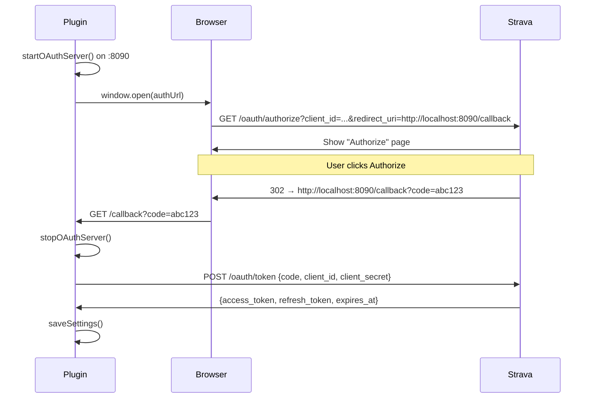

# OAuth Flow

---

## Overview

The plugin implements the [Strava OAuth2 Authorization Code Flow](https://developers.strava.com/docs/authentication/). Because Obsidian is an Electron desktop app with full Node.js access, a temporary HTTP server can be spun up locally to catch the redirect.

---

## Step-by-step



---

## Implementation

### `connectToStrava()`

Entry point. Validates that `clientId` and `clientSecret` are set, then starts the server and opens the browser.

```typescript
async connectToStrava() {
    const redirectUri = `http://localhost:${OAUTH_PORT}/callback`;
    const authUrl = `https://www.strava.com/oauth/authorize`
        + `?client_id=${this.settings.clientId}`
        + `&redirect_uri=${encodeURIComponent(redirectUri)}`
        + `&response_type=code`
        + `&scope=activity:read_all,read`;

    await this.startOAuthServer();
    window.open(authUrl);
}
```

### `startOAuthServer()`

Creates a one-shot Node.js `http.Server` that listens on `OAUTH_PORT` (8090). It handles exactly one request (`/callback`) and then shuts itself down.

```typescript
private startOAuthServer(): Promise<void> {
    return new Promise((resolve, reject) => {
        const http = require("http");
        this.oauthServer = http.createServer(async (req, res) => {
            const url = new URL(req.url, `http://localhost:${OAUTH_PORT}`);
            if (url.pathname !== "/callback") return;

            const code = url.searchParams.get("code");
            // ... respond to browser, stop server, exchange code
        });
        this.oauthServer.listen(OAUTH_PORT, () => resolve());
    });
}
```

!!! note "Why `require('http')`?"
    The plugin uses CommonJS `require` rather than an ES import because esbuild marks Node built-ins as external. The `http` module is available at runtime in Obsidian's Electron environment.

### `exchangeCodeForTokens(code)`

POSTs to `https://www.strava.com/oauth/token` using Obsidian's `requestUrl` helper (bypasses CORS restrictions).

```typescript
const response = await requestUrl({
    url: "https://www.strava.com/oauth/token",
    method: "POST",
    headers: { "Content-Type": "application/json" },
    body: JSON.stringify({
        client_id: this.settings.clientId,
        client_secret: this.settings.clientSecret,
        code,
        grant_type: "authorization_code",
    }),
});
this.settings.accessToken  = response.json.access_token;
this.settings.refreshToken = response.json.refresh_token;
this.settings.tokenExpiresAt = response.json.expires_at;
```

---

## Token Refresh

`getValidAccessToken()` is called before every sync. It compares the current time to `tokenExpiresAt` with a 5-minute buffer.

```typescript
private async getValidAccessToken(): Promise<string | null> {
    if (!this.settings.accessToken) return null;

    if (Date.now() / 1000 > this.settings.tokenExpiresAt - 300) {
        const ok = await this.refreshAccessToken();
        if (!ok) {
            new Notice("Failed to refresh token. Please reconnect.");
            return null;
        }
    }
    return this.settings.accessToken;
}
```

`refreshAccessToken()` POSTs to the same endpoint with `grant_type: "refresh_token"`. Strava returns a new access token **and** a new refresh token — both are saved.

---

## Security Notes

- Credentials are stored in `.obsidian/plugins/obsidian-strava-sync/data.json` — local to the vault
- The local server only lives for the duration of the OAuth handshake, then is destroyed
- The plugin requests only the `activity:read_all,read` scope — read-only access to activities
- No credentials are ever sent to any server other than `strava.com`
