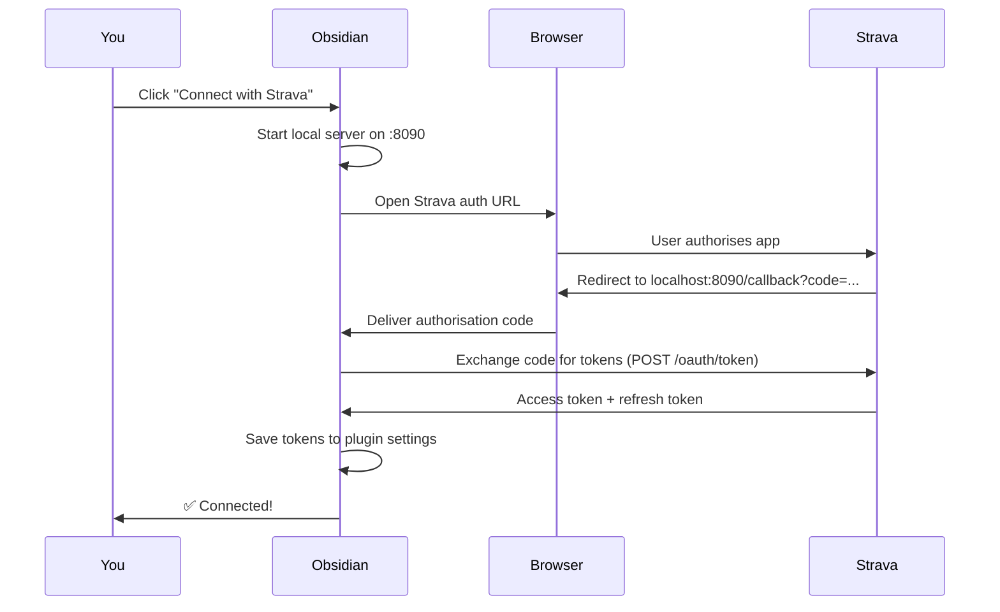

# Authentication

The plugin uses **Strava's OAuth2 flow** — the same standard used by all official Strava integrations. Your credentials are stored locally in Obsidian's plugin data and never leave your machine.

---

## How it Works

1. The plugin starts a **temporary HTTP server on port 8090** to catch Strava's redirect
2. Your browser is opened to Strava's authorisation page
3. After you click **Authorise**, Strava redirects to `http://localhost:8090/callback`
4. The plugin exchanges the one-time code for an **access token** and **refresh token**
5. The local server is shut down immediately after

!!! info "Port 8090"
    Port 8090 is used as the OAuth callback. If another application is already using this port, the connection will fail. In that case, quit the other application and try again.

---

## Token Storage

| Token | What it does | Where it's stored |
|---|---|---|
| **Access token** | Authorises API requests | Obsidian plugin data (local) |
| **Refresh token** | Renews the access token | Obsidian plugin data (local) |
| **Expiry timestamp** | Tracks when to refresh | Obsidian plugin data (local) |

Tokens are stored in `.obsidian/plugins/obsidian-strava-sync/data.json` inside your vault. This file is local only.

---

## Automatic Token Refresh

Strava access tokens expire after **6 hours**. The plugin automatically refreshes the token before each sync — you never need to re-authorise unless you revoke access on Strava's side.

The refresh happens silently: if your token expires between syncs, it is renewed in the background before the first API call is made.

---

## Disconnecting

To revoke the plugin's access:

1. Open **Settings → Strava Sync**
2. Click **Disconnect**

This clears the stored tokens from Obsidian. To fully revoke access on Strava's side, go to [strava.com/settings/apps](https://www.strava.com/settings/apps) and remove the application.

---

## Troubleshooting

??? question "The browser opens but nothing happens in Obsidian"
    Make sure port 8090 is not blocked by a firewall or used by another application. Try disconnecting and connecting again.

??? question "I get 'Authorization failed' in the browser"
    Check that the **Authorization Callback Domain** in your Strava app settings is set to exactly `localhost` (no `http://`, no trailing slash).

??? question "Token refresh failed — please reconnect"
    Your refresh token has been revoked (e.g. you changed your Strava password, or revoked the app). Click **Connect with Strava** again to re-authenticate.
