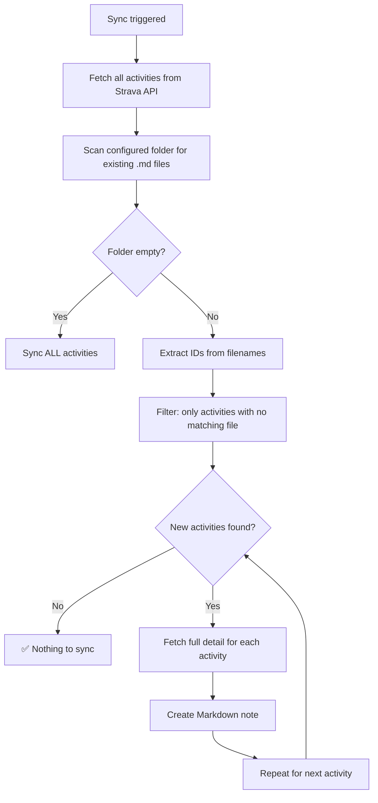

# Syncing

---

## How Sync Works

The plugin uses a **folder-based sync strategy** — no internal ID list, no database.



### ID detection from filenames

The plugin extracts Strava IDs from the **leading digits** of each filename:

```
17930701177 Morning Run.md  →  ID: 17930701177
17850234810 Evening Ride.md →  ID: 17850234810
```

This means:

- ✅ Deleting a note → it will be re-created on the next sync
- ✅ Renaming a note → the ID is lost from the name, so it syncs again
- ✅ Moving a note to a different folder → syncs again (only the configured folder is scanned)

!!! tip "Keep the ID in your filename"
    Using `{{id}}` in your filename pattern (the default) ensures the sync engine always recognises existing notes correctly.

---

## Triggering a Sync

**Ribbon icon** — click the 🏃 icon in the left sidebar.

**Command Palette** — `Cmd/Ctrl+P`, then search for:

| Command | What it does |
|---|---|
| `Sync new Strava activities` | Normal sync — skips existing notes |
| `Re-sync all Strava activities (overwrite existing)` | Re-creates every note — useful after changing the template |

**Settings button** — **Settings → Strava Sync → Sync now**

---

## Re-syncing All Activities

Use the **Re-sync all** button (Settings → Advanced) or the command to overwrite all existing notes. This is useful when you:

- Change the activity template
- Change the folder or filename format
- Want to pick up a Strava activity you edited (e.g., added a private note)

Re-sync does **not** delete any files — it only overwrites `.md` files that are re-created.

---

## Rate Limiting

Strava allows **100 API requests per 15 minutes** and **1 000 per day**.

The plugin fetches one additional detail request per new activity (to get `description`, `private_note`, and the full-resolution GPS polyline). With many new activities, this can exhaust the rate limit.

### What happens when the limit is hit

1. The request fails with HTTP `429 Too Many Requests`
2. The plugin waits and retries automatically:

    | Attempt | Wait time |
    |---|---|
    | 1st retry | 1 minute |
    | 2nd retry | 2 minutes |
    | 3rd retry | 5 minutes |

3. If all retries fail, the activity is still saved using the **list-endpoint data** (no description/private note, lower-res polyline) — it is not lost
4. A notification is shown during each wait period

!!! info "Initial sync with a large history"
    If you have hundreds of activities, the first sync may take a while due to rate limiting. Leave Obsidian open and it will complete automatically — no action needed.
